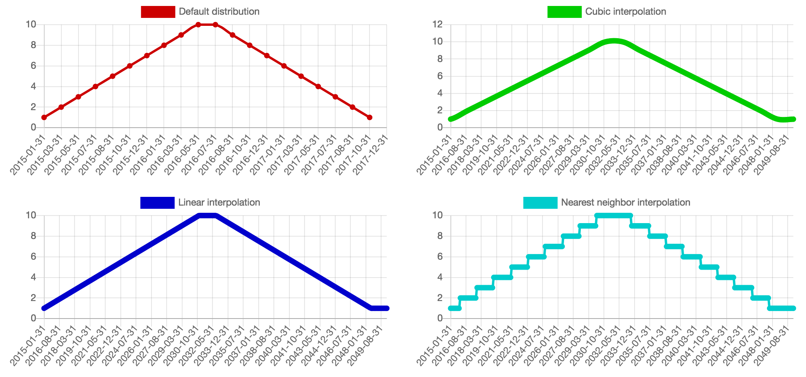

## Smooth PHP
#### Description
Smooth PHP takes an array of numbers or vectors and returns a parametric function that continuously interpolates that array. Smooth PHP supports several interpolation methods, and flexible options for boundary behavior.
It is PHP port of following JavaScript/CofeeScript project:
[Smooth.js](https://github.com/osuushi/Smooth.js/)

#### Usage

    <?php
    use softmetrix\Smooth\Smooth;

    $defaultDistribution = [1, 2, 3, 4, 5, 6, 7, 8, 9, 10, 10, 9, 8, 7, 6, 5, 4, 3, 2, 1];
    $smooth = new Smooth($defaultDistribution, Smooth::METHOD_CUBIC);
    echo $smooth->val(2.5);
    // output: 3.5
    ?>

#### Screen Shot
